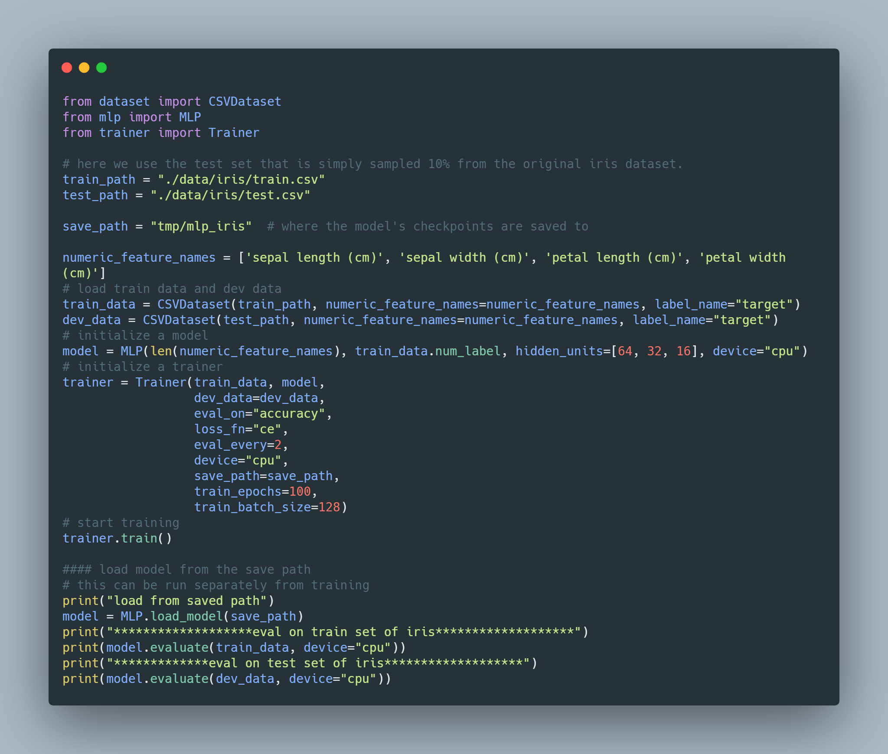

## MTS (MLP-Torch-Sklearn): Pytorch MLP implementation for Sklearn-like datasets classification and regression.

### [Demo](example.py)



The output will be:

```python
*******************eval on train set of iris*******************
         0.0       1.00      1.00      1.00         6
         1.0       1.00      1.00      1.00         3
         2.0       1.00      1.00      1.00         6

    accuracy                           1.00        15
   macro avg       1.00      1.00      1.00        15
weighted avg       1.00      1.00      1.00        15
```

** will add this to a Colab notebook


### Features
- Regression/classification using sklearn-like (numeric csv) datasets
- Logging, model loading and saving, hyper-parameter tuning, easy model configuration.
- Well-deigned for pytorch-preferred users who just stepped to the world of deep learning (DL) and want to understand important DL concepts with some toy examples.

### Quickstart
- Install
```
git clone https://github.com/wangcongcong123/mts.git
pip install -r requirements.txt
```
- Obtain and split a data set

```
python obtain_split_data --dataset_name iris --test_size 0.1 
python obtain_split_data --dataset_name covtype --test_size 0.1 
python obtain_split_data --dataset_name digits --test_size 0.1 
python obtain_split_data --dataset_name boston --test_size 0.1
```
** try `python obtain_split_data.py --help` for the details of each parameter.

- Train and eval

```
python run.py --dataset_name iris --task cls --train_epochs 100 --train_batch_size 130 --device cpu --lr 0.03 --do_train --do_eval

python run.py --dataset_name covtype --task cls --train_epochs 120 --train_batch_size 128 --device cuda --lr 0.003 --do_train --do_eval

python run.py --dataset_name digits --task cls --train_epochs 100 --train_batch_size 128 --device cpu --lr 0.003 --do_train --do_eval

python run.py --dataset_name boston --task reg --train_epochs 100 --train_batch_size 128 --device cpu --lr 0.03 --do_train --do_eval
```
** try `python run.py --help` for the details of each parameter.

- Tracking the training process using tensorboard.
    - here is [an example of training using iris](https://tensorboard.dev/experiment/eSaz76ckRR2tRpEWF5BUvQ/#scalars)

### Datasets available so far
- [boston (regression)](https://scikit-learn.org/stable/modules/generated/sklearn.datasets.load_boston.html#sklearn.datasets.load_boston)
- [covtype (classification)](https://scikit-learn.org/stable/modules/generated/sklearn.datasets.fetch_covtype.html#sklearn.datasets.fetch_covtype)
- [digits (classification)](https://scikit-learn.org/stable/modules/generated/sklearn.datasets.load_digits.html#sklearn.datasets.load_digits)
- [iris (classification)](https://scikit-learn.org/stable/modules/generated/sklearn.datasets.load_iris.html#sklearn.datasets.load_iris)

** There are many [others](https://scikit-learn.org/stable/datasets/index.html), which encourages the community to incorporate them into this repository.

